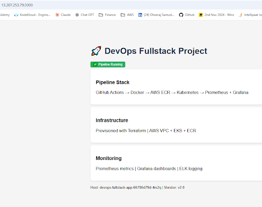
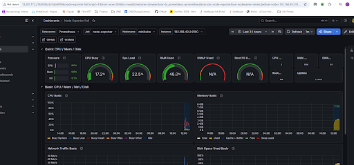
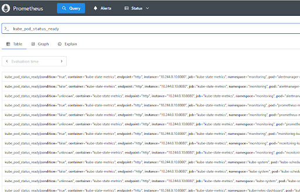
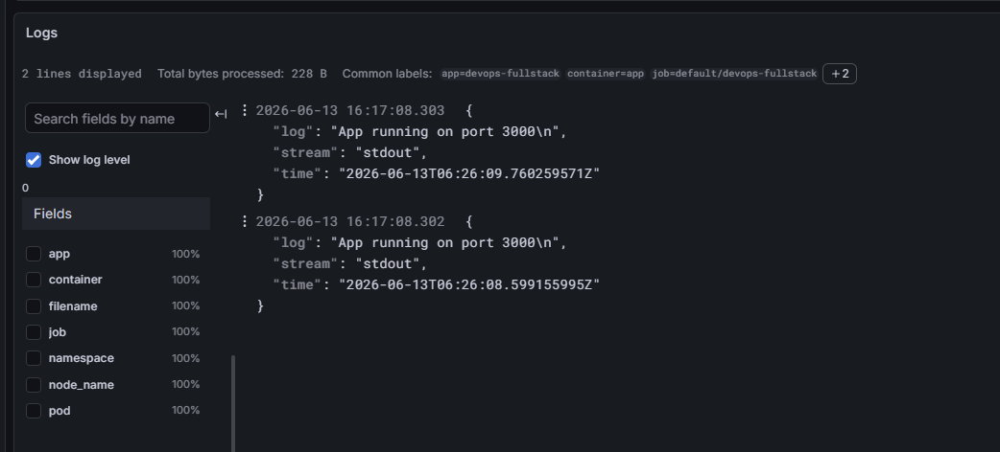
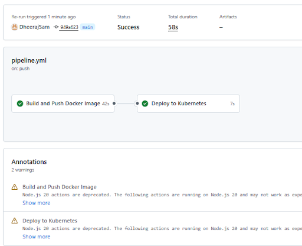
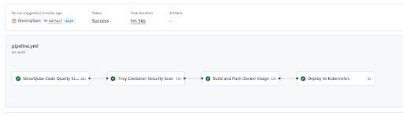
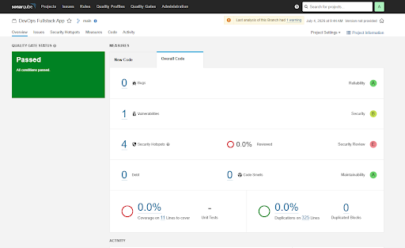
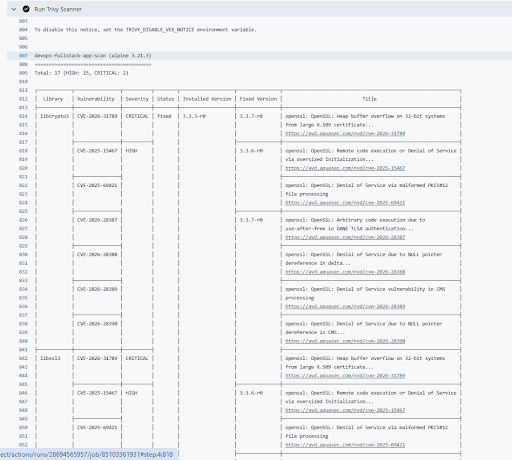

# 🚀 Full-Stack DevOps Pipeline — End-to-End Production Architecture

## Project 1 — Full Stack DevOps Pipeline

## Architecture

GitHub Push → GitHub Actions → Docker → DockerHub

↓

Terraform (VPC + EC2 + IAM + SG)

↓

Kubernetes (2 replicas)

↓

Prometheus + Grafana + Loki Monitoring

## Stack
| Tool | Purpose |
|---|---|
| GitHub Actions | CI/CD Pipeline |
| Docker | Containerization |
| Terraform | AWS Infrastructure as Code |
| Kubernetes | Container Orchestration |
| Prometheus + Grafana | Monitoring & Dashboards |
| Loki + Promtail | Log Aggregation |

## Screenshots

## Project 2 — DevSecOps Pipeline (SonarQube + Trivy)

🔐 DevSecOps Pipeline — Security-First CI/CD with SonarQube + Trivy

End-to-end DevSecOps implementation — automated code quality and container vulnerability scanning integrated into the CI/CD pipeline. Security gates run before every deployment.

🏗️ Architecture

GitHub Push
     ↓
SonarQube Code Quality Scan (self-hosted on AWS EC2)
     ↓
Trivy Container Vulnerability Scan
     ↓
Build & Push Docker Image to DockerHub
     ↓
Deploy to Kubernetes

Security is "shifted left" — issues are caught before they reach production, not after.

🔧 Tech Stack

ToolPurposeGitHub ActionsPipeline orchestrationSonarQubeStatic code analysis — bugs, code smells, security hotspotsTrivyContainer image vulnerability scanning (CVEs)DockerContainerizationDockerHubContainer registryKubernetesDeployment targetAWS EC2Self-hosted SonarQube server

📁 Repository Structure

devops-fullstack-project/
├── .github/
│   └── workflows/
│       └── pipeline.yml        # 4-stage DevSecOps pipeline
├── k8s/
│   ├── deployment.yaml         # Kubernetes deployment
│   └── service.yaml            # Kubernetes service
├── sonar-project.properties    # SonarQube project config
├── app.js                      # Node.js application
├── Dockerfile                  # Container build instructions
└── package.json

🔄 Pipeline Stages

Stage 1 — SonarQube Code Quality Scan ✅

Checks code for bugs, vulnerabilities, code smells
Uses self-hosted SonarQube running as Docker container on AWS EC2
Configured via sonar-project.properties
Pipeline proceeds only if quality gate passes

Stage 2 — Trivy Container Security Scan ✅

Builds Docker image locally on GitHub Actions runner
Scans image for known CVEs (Common Vulnerabilities and Exposures)
Reports CRITICAL and HIGH severity vulnerabilities
Industry-standard tool used by enterprises like Aqua Security

Stage 3 — Build and Push Docker Image ✅

Only runs after both security scans pass
Tags image with build number for versioning
Pushes to DockerHub

Stage 4 — Deploy to Kubernetes ✅

SSHs into EC2 running Kubernetes
Applies latest manifests from k8s/ folder
Rolling update — zero downtime deployment

📸 Screenshots

1. Full Pipeline — All 4 Stages Green
Complete DevSecOps pipeline passing all security gates — SonarQube quality scan, Trivy vulnerability scan, Docker build, and Kubernetes deployment all completing successfully in under 2 minutes.

2. SonarQube Dashboard — Code Analysis Results
Self-hosted SonarQube running on AWS EC2 showing code quality metrics — bugs, vulnerabilities, code smells, and security hotspots detected in the Node.js application source code.

3. Trivy Scan Output — Vulnerability Report
Trivy scanning the Docker image for CVEs — showing CRITICAL and HIGH severity vulnerabilities found in OS packages and application dependencies.

🚀 How to Reproduce

1. Set Up SonarQube on EC2

bash# SSH into EC2
ssh -i ~/.ssh/devops-key ubuntu@EC2-IP

# Install Docker
sudo apt update && sudo apt install docker.io -y
sudo systemctl start docker
sudo sysctl -w vm.max_map_count=262144

# Run SonarQube
sudo docker run -d \
  --name sonarqube \
  -p 9000:9000 \
  -e SONAR_CE_JAVAOPTS="-Xmx512m" \
  -e SONAR_WEB_JAVAOPTS="-Xmx512m" \
  sonarqube:lts-community

# Access at http://EC2-IP:9000 (admin/admin)

2. Generate SonarQube Token

Login to SonarQube → My Account → Security
Generate token → copy it

3. Add GitHub Secrets

SecretValueSONAR_TOKENSonarQube tokenSONAR_HOST_URLhttp://EC2-IP:9000DOCKERHUB_USERNAMEDockerHub usernameDOCKERHUB_TOKENDockerHub access tokenEC2_HOSTEC2 public IPEC2_SSH_KEYPrivate SSH key contents

4. Push Code — Pipeline Triggers Automatically

bashgit add .
git commit -m "Trigger DevSecOps pipeline"
git push origin main

🔐 Security Concepts Demonstrated

🧹 Cleanup

bash# Destroy EC2 (SonarQube server)
cd terraform
terraform destroy

💡 Interview Talking Points

"What is DevSecOps?" — Integrating security into every stage of the DevOps pipeline rather than treating it as a separate phase at the end
"What is Trivy?" — An open-source vulnerability scanner for containers, file systems, and Git repos — scans for CVEs in OS packages and application dependencies
"What is SonarQube?" — A static code analysis tool that detects bugs, security vulnerabilities, and code smells before code reaches production
"What is shift-left security?" — Moving security checks earlier in the development process — catching vulnerabilities at code commit rather than after deployment

👤 Author

Dheeraj Samudrala — DevOps Engineer

LinkedIn: linkedin.com/in/dheeraj-samudrala-b99b9540
GitHub: github.com/DheerajSam

