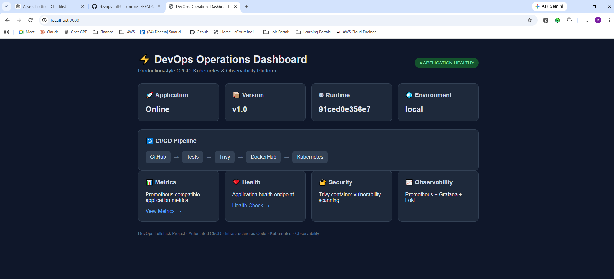

# Full-Stack DevOps Pipeline

A hands-on DevOps project demonstrating CI/CD, Docker containerization, Infrastructure as Code, Kubernetes deployment structure, security scanning, and application observability.

## Architecture

```text
GitHub Push
    ↓
GitHub Actions
    ↓
Node.js Tests + Health Check
    ↓
Docker Build
    ↓
Trivy Security Scan
    ↓
DockerHub
    ↓
Kubernetes
    ↓
Prometheus + Grafana + Loki
```

## Technology Stack

| Tool | Purpose |
|---|---|
| Node.js / Express | Application |
| GitHub Actions | CI/CD Pipeline |
| Docker | Containerization |
| DockerHub | Container Registry |
| Trivy | Container Vulnerability Scanning |
| Terraform | AWS Infrastructure as Code |
| Kubernetes | Container Orchestration |
| Prometheus | Application Metrics |
| Grafana | Monitoring Dashboards |
| Loki + Promtail | Log Aggregation |

## CI/CD Pipeline

The current GitHub Actions pipeline performs:

1. Checkout source code
2. Set up Node.js
3. Install dependencies
4. Run Jest tests
5. Start the application and verify `/health`
6. Build the Docker image
7. Scan the image with Trivy
8. Push the image to DockerHub

The Docker image is scanned before it is pushed to the registry.

Images are tagged with:

- Git commit SHA
- `latest`

GitHub Actions caching is also enabled to improve Docker build times.

## Docker

The application uses a multi-stage Docker build.

The production image:

- Uses Node.js Alpine
- Installs production dependencies only
- Removes npm from the runtime image
- Runs as the non-root `node` user
- Exposes port 3000

Example:

```bash
docker build -t devops-fullstack-app .
docker run -p 3000:3000 devops-fullstack-app
```

Health check:

```bash
curl http://localhost:3000/health
```

## Application

The application provides a simple DevOps operations dashboard.

Available endpoints:

| Endpoint | Purpose |
|---|---|
| `/` | Application dashboard |
| `/health` | Application health check |
| `/metrics` | Prometheus metrics |

The application exposes HTTP request count and request duration metrics using the Prometheus client library.

## Screenshots

### Application Dashboard



The dashboard shows application health, version, runtime information, environment, CI/CD stages, metrics, security, and observability information.

## Kubernetes

Kubernetes manifests are available in the `k8s/` directory.

The project includes:

- Deployment
- Service
- Multiple application replicas
- Rolling update configuration

The Kubernetes deployment workflow is currently disabled because the AWS/Kubernetes environment is not running continuously.

The Kubernetes configuration is retained for future use and hands-on practice.

## Infrastructure

Terraform configuration is available in the `terraform/` directory.

The project was used to provision and work with AWS infrastructure including:

- VPC
- Subnets
- Internet Gateway
- Security Groups
- EC2

The infrastructure provided a hands-on environment for deploying and testing the application.

## Monitoring and Observability

The application exposes Prometheus metrics through `/metrics`.

Prometheus can collect application metrics and Grafana can be used to visualize:

- HTTP request count
- Request duration
- Application health
- Service performance

Loki and Promtail were also used for centralized application log collection.

## Security

Trivy is integrated into the CI pipeline to scan the Docker image for known vulnerabilities.

The pipeline checks for:

- HIGH vulnerabilities
- CRITICAL vulnerabilities

The pipeline fails when matching vulnerabilities are detected.

This provides a basic DevSecOps security gate before publishing the image.

## Testing

Jest and Supertest are used for application testing.

Current tests cover:

- `/health`
- `/`

Run tests locally:

```bash
npm ci
npm test
```

## Repository Structure

```text
devops-fullstack-project/
│
├── .github/
│   └── workflows/
│       └── pipeline.yml
│
├── k8s/
│   ├── deployment.yaml
│   └── service.yaml
│
├── terraform/
│
├── tests/
│   └── app.test.js
│
├── docs/
│   └── screenshots/
│       └── application-dashboard.png
│
├── app.js
├── Dockerfile
├── package.json
├── .dockerignore
└── .gitignore
```

## What I Practiced

This project was built to get hands-on experience with:

- Git and GitHub
- GitHub Actions
- CI/CD pipelines
- Docker
- Docker multi-stage builds
- Container security scanning
- Kubernetes
- Terraform
- AWS EC2
- Prometheus
- Grafana
- Loki
- Linux troubleshooting

## Interview Topics

This project provides hands-on examples for explaining:

- How a CI/CD pipeline works
- Why Docker multi-stage builds are used
- Why the image is scanned before pushing
- How Docker image tags are generated
- How GitHub Actions caching improves build time
- How Kubernetes Deployments and Services work
- How rolling updates work
- How Terraform provisions AWS infrastructure
- How Prometheus collects application metrics
- How Grafana visualizes metrics
- How Trivy detects container vulnerabilities
- How application health checks are implemented

## Author

Dheeraj Samudrala

GitHub: https://github.com/DheerajSam
